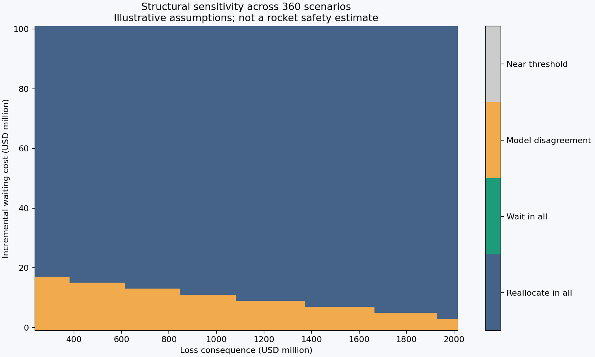
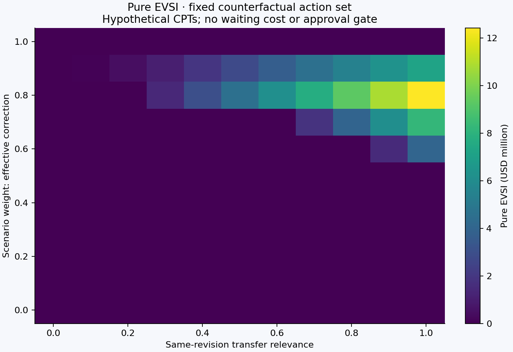

# Project Vulcan
**Probabilistic decision analysis under uncertainty in aerospace operations**

[Methodology](docs/RESEARCH_OVERVIEW.md) · [Reproduce](docs/REPRODUCIBILITY.md) · [Results and limitations](docs/SCIENTIFIC_LIMITATIONS.md) · [Architecture](docs/SOFTWARE_ARCHITECTURE.md) · [Data provenance](docs/DATA_PROVENANCE.md) · [3D visualization](visualization/README.md)

Project Vulcan is an independent research-software study of a difficult decision: **when does observing an additional flight provide enough information to justify postponing a hypothetical launch procurement decision?**

The project combines Bayesian inference, value-of-information calculations, exact numerical integration, scenario analysis, and a separately evaluated experimental forecasting benchmark. The launch-vehicle case is intentionally **illustrative**: public anomaly reports cannot calibrate the probability of a particular future mission's loss.

> **Scientific scope.** This repository is a reproducible decision-analysis laboratory, **not** a launch-readiness assessment, certified reliability model, flight-safety recommendation, or NASA/ULA/Northrop Grumman product. All unmeasured consequence probabilities and economic values are explicitly hypothetical.

## Research question

The model compares procuring an alternative launch provider immediately with waiting for a public observation from a further Vulcan flight. Its decision tree distinguishes physical anomaly counts, public reporting, configuration/revision assumptions, mission consequences, authorization, and opportunity costs. The choice is evaluated *conditional on declared assumptions*, not presented as operational advice.

The key methodological result is that **the same observed booster history and the same distribution of public flight reports can support opposite economic decisions** when the future mission's unobserved consequence model changes. The constructive counterexample and sharp conditional bounds are developed in [research PR #2](https://github.com/MedeiroszJoao/Project-Vulcan/pull/2).

## Evidence at a glance

| Analysis | Observation | What it supports |
| --- | --- | --- |
| Original reference model (`main`) | At a hypothetical $10 million waiting cost: $35.750 million to reallocate now versus $44.471 million to wait. | Conditional decision arithmetic; **not** an actual procurement recommendation. |
| Non-identifiability ([PR #2](https://github.com/MedeiroszJoao/Project-Vulcan/pull/2)) | Under a specified consequence-CPT simplex, the net benefit of waiting spans **−$15.000 million to +$10.620 million**. | No robust decision under that uncertainty set with the other assumptions held fixed. |
| NASA battery benchmark ([PR #3](https://github.com/MedeiroszJoao/Project-Vulcan/pull/3)) | On four physical cells, the linear model's nominal 90% intervals covered **60.3%** of 257 serially correlated held-out observations. | Improved point error need not imply reliable predictive intervals. |
| NASA out-of-cohort test ([PR #4](https://github.com/MedeiroszJoao/Project-Vulcan/pull/4)) | Eleven cells across heterogeneous experimental protocols; conclusions depend materially on aggregation and interval width. | Stress test of forecasting methods; **not** rocket propulsion validation. |

**Status:** The original reference scripts and forecasts are on `main`. The research extensions above remain separate draft pull requests; they are *not* represented as merged features. This portfolio branch refines presentation and software verification independently of their scientific review. See [research status](docs/RESEARCH_OVERVIEW.md).

## Figures

| Decision sensitivity | Expected value of information |
| --- | --- |
|  |  |

These figures describe specified hypothetical scenarios. Frequencies over the parameter grid are not posterior probabilities and have no direct rocket safety interpretation.

## Reproduce the baseline

Requires **Python 3.12**. Use an isolated environment and run from the repository root:

```bash
python -m venv .venv
# macOS/Linux: source .venv/bin/activate
# Windows PowerShell: .venv\Scripts\Activate.ps1
python -m pip install -r requirements.txt
python -m unittest discover -s tests -v
python verify_frozen_forecasts.py
python run_analysis.py
python independent_numeric_check.py
```

The baseline does not need proprietary telemetry. A full workflow and environment notes are in [reproducibility](docs/REPRODUCIBILITY.md). The NASA test data are **not** bundled with the core repository; experimental branches identify their external sources and pin input hashes.

## Repository map

```text
src/                 probabilistic model, operations, scoring
tests/               model and prospective-protocol checks
data/                public source tables and scenario inputs
forecast/            five preserved candidate prediction objects
results/             generated analyses, plots and reference output
docs/                methodology, limitations and scientific records
evidence/            source manifests and dated review artifacts
visualization/       explanatory interactive model (not CAD)
.github/workflows/   automated regression checks
```

Start with [research overview](docs/RESEARCH_OVERVIEW.md), then [architecture](docs/SOFTWARE_ARCHITECTURE.md) and [reproducibility](docs/REPRODUCIBILITY.md). The detailed original working papers (`SPEC.md` and `docs/TECHNICAL_NOTE.md`) are preserved as historical research records; they may contain Portuguese and must not be silently edited into claims of pre-registration.

## Provenance and publication

The original five `forecast/*.json` files are preserved as bytes, with SHA-256 integrity verified independently of tolerant numerical re-derivation. A GitHub commit or successful CI run is not a DOI, independent peer review, or physical validation. A formally archived version should be announced **only after the repository release and any archival identifier are externally verified**.

For source-level assumptions, see [data provenance](docs/DATA_PROVENANCE.md). For external experimental audits, follow the relevant pull-request commits and CI artifacts. See also [scientific limitations](docs/SCIENTIFIC_LIMITATIONS.md).

## License and contributions

Original project source code and documentation are made available under the [MIT license](LICENSE); separately sourced data, manufacturer documents, trademarks, and third-party assets retain their own terms. See [third-party notices](THIRD_PARTY_NOTICES.md) and [contributing](CONTRIBUTING.md). Citation metadata are in [CITATION.cff](CITATION.cff).

**Independent student research software. No affiliation or endorsement by NASA, ULA, Blue Origin, Northrop Grumman, or other organizations mentioned.**
