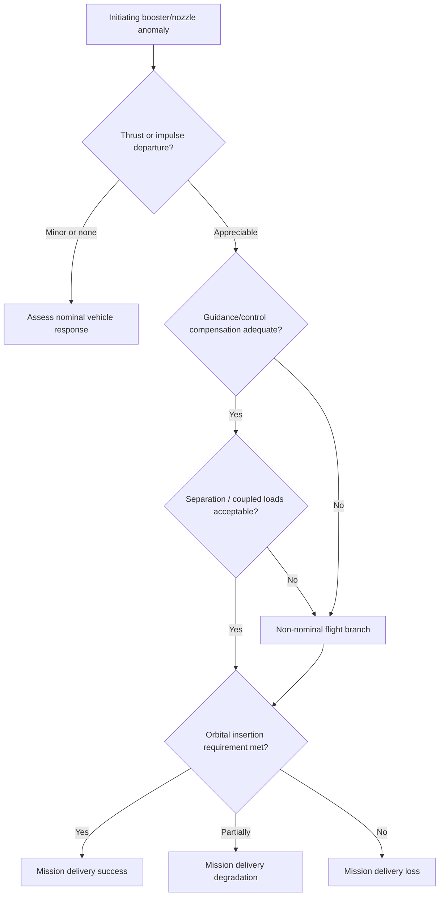
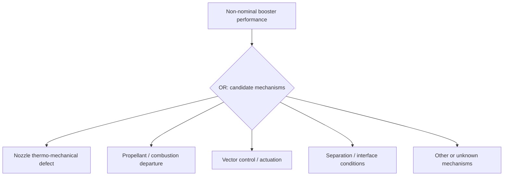

# Mechanistic PRA scaffold — not a quantified or validated Vulcan failure model

**Scope:** an auditable *hypothesis map* for system-risk research. A diagram is not engineering evidence. This branch has no measured thrust curves, engine geometry, loads, or reliable conditional probabilities needed to assign physical risks. It must not replace the existing LV-01 prospective forecast.

## Hypothetical event progression

The branches are *not* assigned numbers and do not claim physical sufficiency, exclusivity or exact causality. A genuine event tree needs branch-state definitions, common-cause modeling, operational history and engineering review.

## Candidate causal origins — not confirmed root causes

Do not sum marginal probabilities of overlapping OR events as though they were independent. The current code's shared-shock parameter rho is **only a mathematical dependence stress test**, not a mechanism-specific estimated common-cause failure probability.

## Missing evidence ledger

| Conditional quantity | Present evidence | Must obtain before quantifying |
|---|---|---|
| Anomaly probability by revision/lot | Sparse *reported* anomalous events; identifiers uncertain | Traceable revision/lot information, observation process |
| Thrust deviation given reported failure | No measured CPT | Public engineering tests or reviewed physical constraints |
| Compensability given impulse deviation | No measured CPT | GNC/trajectory state, performance envelopes, validation |
| Structural/separation adequacy | No measured CPT | Loads, margins, model of separation dynamics |
| Orbit delivery consequences | Unvalidated target CPT | Defined target mission, performance requirements and traceable physical model |
| Probability event enters public record | Hypothesized 0.9 disclosure baseline | Historical capture/ascertainment data, state-dependence |

**Approval gate:** a specialist should be able to refute the mechanism nodes and proposed constraints before any step is relabeled from `unidentified` to `physically_constrained`. Until then, no numerical physical-loss forecast should be marketed.
