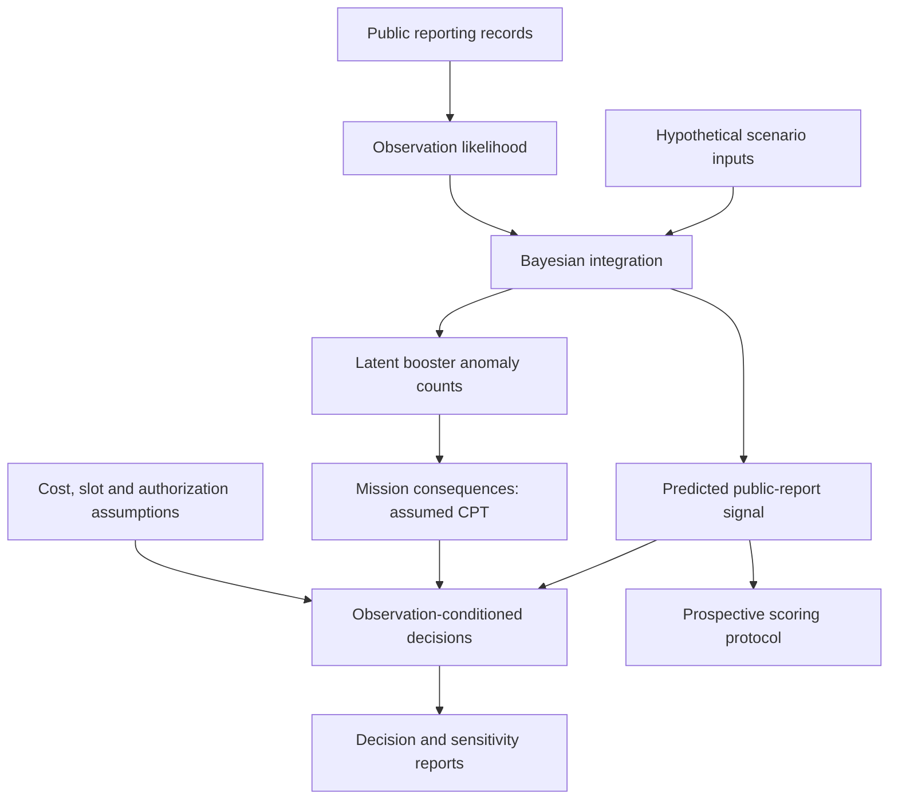

# Software architecture

This repository separates public-source observations, a scenario-conditional probabilistic model, conditional economic decisions and the public reporting/scoring layer.

| Module | Responsibility |
| --- | --- |
| `src/model.py` | Scenario configuration, historical likelihood, quadrature, joint distributions and value-of-information arithmetic |
| `src/operations.py` | Scenario-specific schedule, authorization and alternative-launch decisions |
| `src/prospective.py` | Public-signal forecasts, hypothetical physical anomaly counts and categorical proper scores |
| `src/scoring.py` | Offline checks for the prospective record and evidence timing |
| `run_analysis.py` | Decision surfaces, summary tables and figures |
| `run_audit_response.py` | Original extended scenario and adversarial sensitivities |
| `verify_frozen_forecasts.py` | Exact stored-file integrity and tolerant fresh recomputation (separate assertions) |
| `tests/` | Numerical and protocol regression tests |

The `evidence/`, `forecast/` and `results/` folders are research artifacts, not disposable build cache. Treat historical input and prediction hashes as immutable provenance.

## Dependency policy

Only the baseline dependencies listed in `requirements.txt` are necessary for the core Python workflow. Research pull requests may require additional data retrieval and dependencies. The 3D viewer is independent of the Python model and uses Three.js; it is explanatory, not a GNC or CAD simulation.

## Development boundaries

The uncertainty distribution for physical consequences is not trained from hardware telemetry. Do not wire illustrative 3D components to claim measured motor failure rates, actual nozzle loads, manufacturer test results or operational safety margins.
